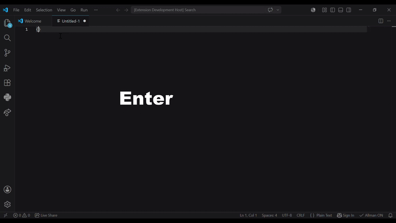

# Allman Braces V2

Automatically expands inline curly braces to **Allman style** when pressing `Enter`.

## Demo



## What it does

When your cursor is placed between `{` and `}` and you press `Enter`, this:

```c
myFunction(){}
```

becomes:

```c
myFunction()
{

}
```

The cursor lands on the empty line inside the braces, ready to type.

## Toggle

You can enable or disable the extension at any time without uninstalling it.

| Action | Result |
|---|---|
| `Ctrl+Shift+Alt+A` | Toggle on/off |
| Click status bar button | Toggle on/off |

When disabled, the status bar shows **Allman OFF** in orange.

## Why Allman?

Allman style places the opening brace on its own line, making block structure visually clear. It's widely used in C, C++, C# and similar languages.

## Usage

1. Place your cursor between `{` and `}`
2. Press `Enter`
3. Done

Works at any indentation level:

```c
if (condition){}
```
```c
if (condition)
{

}
```

## Release Notes

### 0.0.2
- Added toggle on/off via `Ctrl+Shift+Alt+A` or status bar button

### 0.0.1
Initial release.